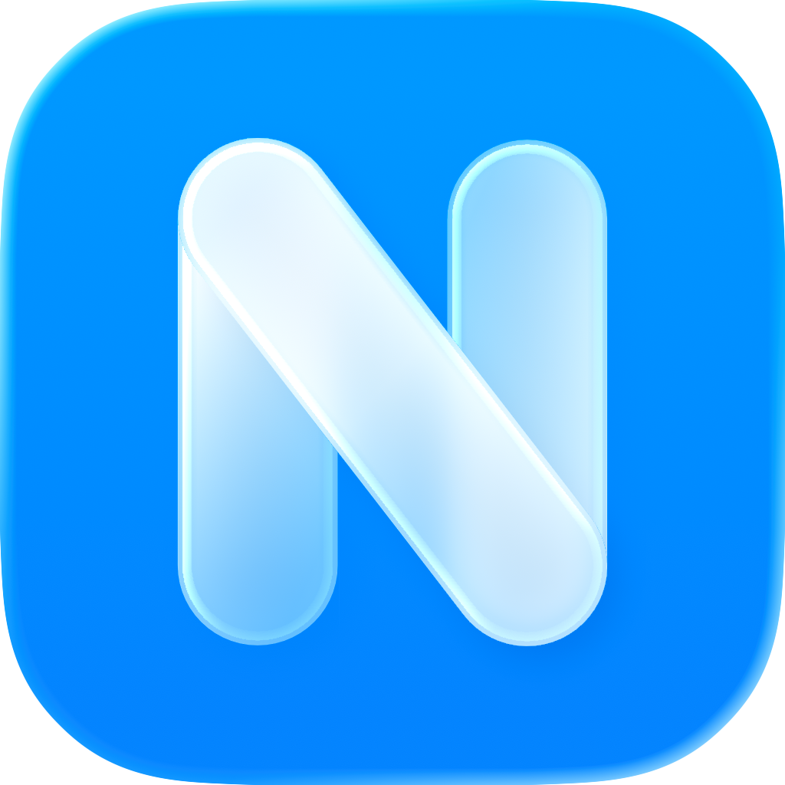

# Nagram Desktop

Nagram Desktop is an independent Telegram client built with Qt, based on
[Telegram Desktop](https://github.com/telegramdesktop/tdesktop).

- [Feature requirements](docs/nagram/requirements.md) ·
  [Design and roadmap](docs/nagram/design.md)
- [Brand assets and application identity](BRANDING.md)
- Build instructions: [macOS](docs/building-mac.md),
  [Windows](docs/building-win.md), [Linux](docs/building-linux.md)
- [Source](https://github.com/NextAlone/Nagram-qt) ·
  [Releases](https://github.com/NextAlone/Nagram-qt/releases)

The upstream CMake target remains `Telegram`; the resulting desktop executable
is named `Nagram`. Builds require your own Telegram API credentials for
distribution. Upstream automatic updates are disabled; no Nagram update service
or store distribution has been configured.

Source code retains the upstream [GPLv3 license](LICENSE) and [legal notices](LEGAL).
Nagram icon artwork is Copyright © MaitungTM; see [BRANDING.md](BRANDING.md).
